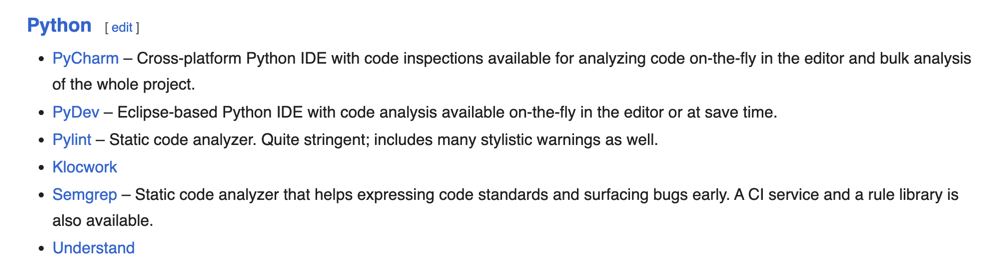

# Test - 1. Mandatory - Personal Test Data Generator

## Tech-stack

**Frontend _Arturo's Fake Data Generator Frontend_**

- _HTML_
- _JS_
- _CSS_

**Backend**
- _Python_ Server
- _Poetry_ as package manager
- _Pylint_ as static analyzer
- _FastAPI_ as web framework
- _Pytest_ as test tool

**Tools**
- E2E w Cypress

---

<br>

## Dev Exp

### Run with _docker-compose_

Ensure to be positioned at `./`

```bash
docker-compose -f docker-compose.dev.yml up
```

Now you have _Python server_ running on `PORT: 8000` and
frontend on `PORT: 3000` served with _Python’s built-in HTTP server_.

---

### Run locally

To run locally Python server ensure to have installed _poetry_

Ensure to be positioned at `./server`

```
poetry shell
uvicorn app.main:app --reload --host 0.0.0.0 --port 8000
```

---

### Testing with Pytest

```bash
poetry run pytest -v
```

---

<br>

### E2E Tests with Cypress

Configuring _Cypress_ for `/client`

```bash
npm init -y
npm install --save-dev cypress
```

Add scripts to `package.json`

```json
"scripts": {
  "cypress:open": "cypress open",
  "cypress:run": "cypress run"
}
```

Initialize Cypress `npx cypress open`

Ensure `cypress.config.js` looks like this:

```javascript
const { defineConfig } = require("cypress");

module.exports = defineConfig({
  e2e: {
    baseUrl: "http://localhost:3000",
    viewportWidth: 1280,
    viewportHeight: 800,
    video: false,
    setupNodeEvents(on, config) {
      // implement node event listeners here if needed
    },
  },
});
```

Run project locally in test mode to test _sqlite3_ `PYTHON_ENV=test poetry run uvicorn app.main:app --host 0.0.0.0 --port 8000`


---

Run _Cypress_ E2E tests:

```bash
npm run cypress:open # test with GUI
npm run cypress:run # headless tests
```

---

<br>

## Configuring the project

Python with Poetry as project management tool and FastAPI as web framework

```bash
poetry init --name fastapi-backend -n
poetry add fastapi uvicorn
```

Adding _Pytest_ to Python server:

```bash
poetry add --dev pytest pytest-asyncio httpx
```

Added this to `pyproject.toml` to define python root path and path for test files

```toml
[tool.pytest.ini_options]
pythonpath = ["."]
testpaths = ["tests"]
```

---

<br>

## Static code analysis

_Pylint_ is configured for the project to ensure clean, readable, and
maintainable code by automatically detecting code style issues and potential errors.



_from https://en.wikipedia.org/wiki/List_of_tools_for_static_code_analysis_

---

### Configuration

The following was done to configure _Pylint_ for `./server` _Python_ project:

```bash
# 1. Add _Pylint_ as dev dependency
poetry run pylint --generate-rcfile > .pylintrc

# 2. Create a _Pylint_ configuration file
poetry run pylint --generate-rcfile > .pylintrc

# 3. Run _Pylint_ via _Poetry_
poetry run pylint app
```